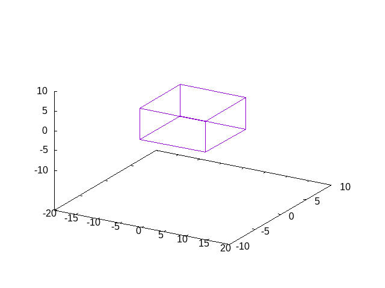

# ParticleTracking

## Overview

`PTMF_3D` is a Fortran program simulating charged particle motion in a 3D magnetic field using the Lorentz force equation. The program utilizes the `my_modules` module for coordinate transformations.

## Features

- **transform Function:** Converts coordinates based on magnetic field and momentum components.
- **inv_transform Function:** Performs an inverse coordinate transformation.

## Usage

- Input from `MF.txt`.
- Set initial position (`x0`, `y0`, `z0`) and momentum (`P0x`, `P0y`, `P0z`).
- Bin dimension and points per revolution (ppr) are user-provided.
- Output trajectory data to `PTMF_3D_*.dat`.

## Initialization

- Initializes variables and opens output files.

## Main Loop

- Computes particle trajectory using the Lorentz force equation.
- Coordinates transformed using `transform` and `inv_transform` functions.

## Output

- Writes trajectory data to `PTMF_3D_*.dat`.
- Simulation stops when position exceeds limits.

## Notes

- Detailed algorithms and principles are explained in the Fortran code.
